# InternLM2实战营第二期-搭建RAG智能助理

## 第三节课 《"茴香豆":零代码搭建你的 RAG 智能助理》
官网地址：[书生·浦语官网](https://internlm.intern-ai.org.cn/)  
课程录播视频链接地址：[搭建个人RAG智能助理_bilibili](https://www.bilibili.com/video/BV1QA4m1F7t4/)

### 1.视频笔记

首先我们在实战之前需要了解几个问题，RAG是什么？RAG原理、RAG&Fine-tune、架构、向量数据库、评估和测试；“茴香豆”的介绍，特点，架构，构建步骤。最后才是实战演练。


#### 1.1RAG是什么？

RAG（Retrieval Augmented Generation）技术，是一种结合信息检索和生成模型的技术，用于提升自然语言处理任务的性能，RAG模型通过在生成答案之前，从一个大型文档库中检索相关信息，从而提供更准确和信息丰富的回答，这种可以结合**外部知识库**来生成更准确、更丰富的回答。解决 LLMs 在处理**知识密集型任务时**可能遇到的挑战, 如**生成幻觉**、**知识过时和缺乏透明、可追溯的推理过程等**。提供更准确的回答、降低推理成本、实现外部记忆。

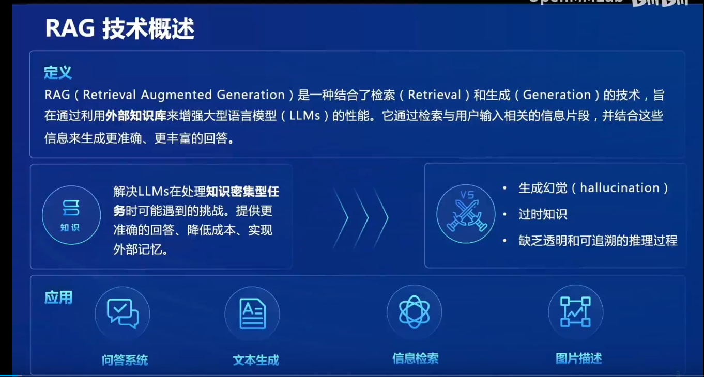

>**外部知识库**：向量数据库、关系型数据库、搜索引擎、文档管理系统，noSQL、数据湖等可以储存知识的并且可以查询的系统。

>**应用**：问答系统、文本生成、信息检索、图片描述等。

例如：InternLM2-chat-7b针对新增知识，未曾训练过的数据会出现一些胡编乱造的幻觉现象，传统解决办法，我们会收集新增知识的语料，通过微调、训练模型的方式来解决，然而这种方式会出现新的问题，如知识更新太快，语料知识库太大，训练成本高、语料很难收集整理等，RAG的出现很好的解决了这些问题。

#### 1.2RAG的工作原理

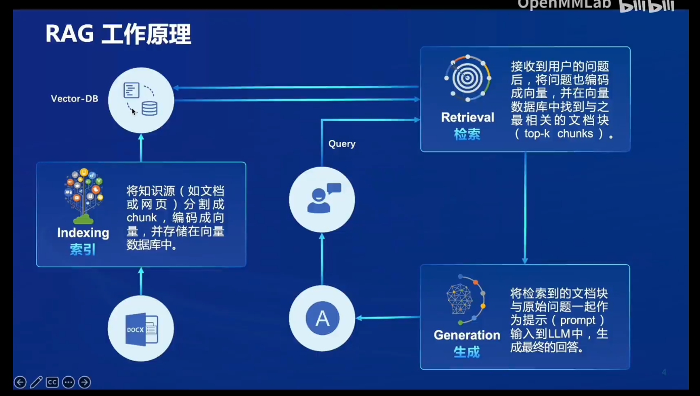

经典的RAG由三个部分组成，索引、检索、生成。

**索引（Indexing）**：将知识源（文档，网页）分割成chunk，编码成向量，并存储在向量数据库中。

**检索（Retrieval）**：接受用户的问题后，将问题的编码成向量，并且在向量数据库中找到与之最相关的文档块（top-k chunks）。

**生成（Generation）**：将检索的文档块与原始问题一起作为提示词（prompt）输入到LLM中，生成最终的回答。

> **1.2.1 什么是Chunk？**
> Chunk是一个较小的文本单元，它是从一个较大的文档中分割出来的。每个chunk通常包含一个或多个句子，或者是一个逻辑段落，具体取决于应用场景和需要处理的任务。Chunk的大小可以根据具体需求进行调整。
> **1.2.2 如何进行Chunking？**
> Chunking的方法可以根据具体的需求和文档的结构进行调整。以下是几种**1.2.3 常见的chunking方法：**
> 1.按句子分割：将文档按句子分割，每个chunk包含一个或多个句子。
> 2.按段落分割：将文档按段落分割，每个chunk包含一个或多个段落。
> 3.固定长度分割：将文档按固定的字符数或单词数进行分割。
> 4.语义分割：基于语义信息，将文档分割成具有完整语义的部分。
> **例如，我们有以下文本：**

```python
自然语言处理（NLP）是人工智能的一个分支，致力于使计算机能够理解和生成人类语言。NLP的应用包括机器翻译、情感分析、文本摘要等。近年来，随着深度学习技术的发展，NLP取得了显著的进步。
```

>我们可以将其按句子进行chunking：
1.Chunk 1: 自然语言处理（NLP）是人工智能的一个分支，致力于使计算机能够理解和生成人类语言。
2.Chunk 2: NLP的应用包括机器翻译、情感分析、文本摘要等。
3.Chunk 3: 近年来，随着深度学习技术的发展，NLP取得了显著的进步。
通过将长文本分割成chunk，我们可以更有效地处理和分析文本数据。

##### 向量数据库（Vector-DB）

向量数据库是RAG技术中存储外部知识库数据的地方，主要是实现将文本及相关数据通过预训练的模型转换成固定长度的向量，这些向量需要很好的捕捉到文本和知识的语义信息及内部联系，向量数据库是实现快速准确回答的基础，一般通过计算余弦相似度、点积运算的方式来判断相似度，检索的结果要根据相似度的得分来排序，把其中最相关的内容用于后续模型回答的生成。


****

RAG的工作流程：

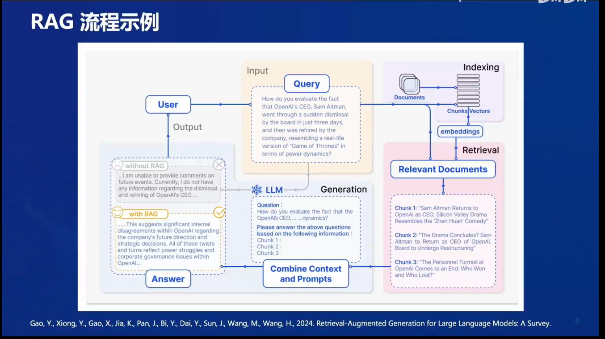

RAG发展历程，是2020年由Meta的Lewis等人最早提出，Naive RAG（问答系统，信息检索）——Advanced RAG（摘要内容、内容推荐）—— Modular RAG（多模态任务、对话系统）等更高级的引用。

##### RAG常见优化方法：

1.提高向量数据库的质量：

**嵌入优化**（Embedding Optimization）：考虑通过结合稀疏编码器和密集检索器，多任务的方式来增强嵌入性能

**索引优化**（Indexing Optimization）：增强数据粒度优化索引结构，添加元数据对齐优化和混合检索策略来提高性能

2.针对查询过程进行优化：

**查询优化**（Query Optimization）：查询扩展、转换，多查询。

**上下文管理**（Context Curation）：重排，上下文选择/压缩来减少检索的冗余信息并提高大模型的处理效率，例如用小一点的语言模型来检测和溢出不重要的语言标记，或者训练信息提取器和信息压缩器。

**迭代检索**（Iterative Retrieval）：根据出事查询和迄今为止的生成的文本进行重复搜索。

**递归检索**（Recursive Retrieval）：迭代细化搜索查询，链式推理指导检索过程

**自适应检索**（Adaptive retrieval）: Flare、Self-RAG等让大模型能够自主的使用LLMs主动决定检索的最佳时期和内容。

**LLM微调**（LLM Fine-tuning）：检索微调，生成微调，双重微调。

#### 1.3 RAG vs 微调（Fine-tuning）

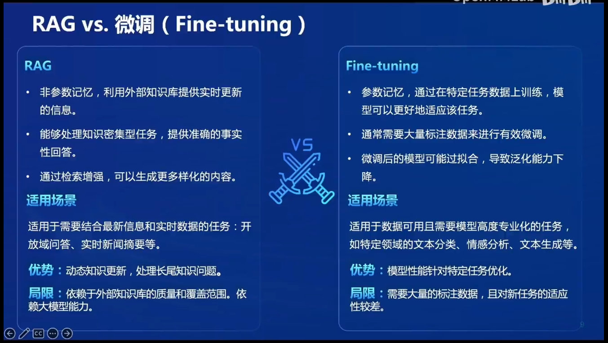

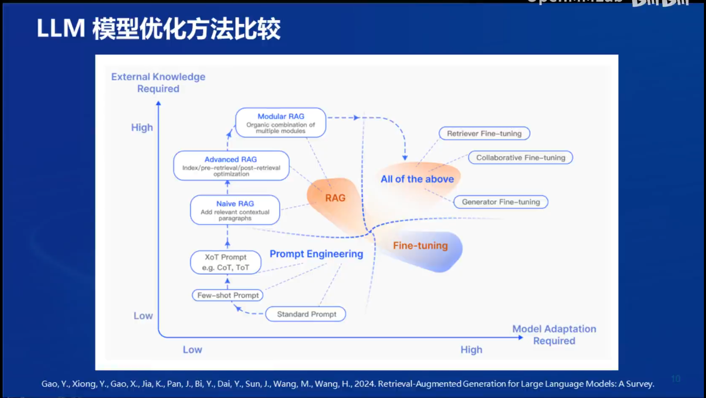

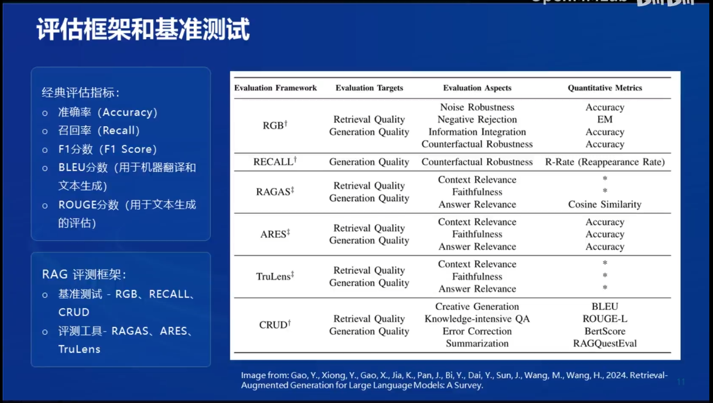

#### 1.4 茴香豆的介绍

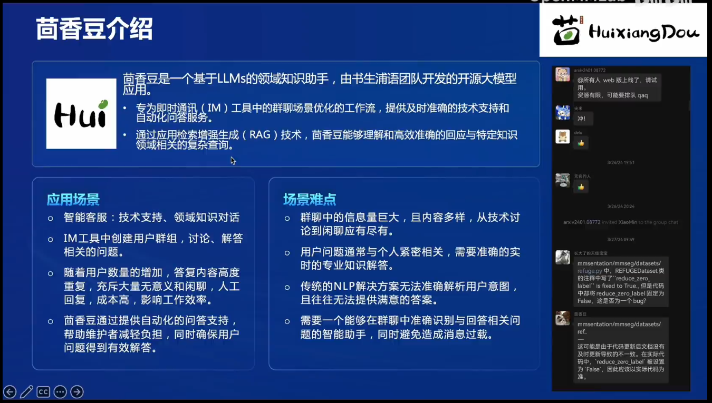

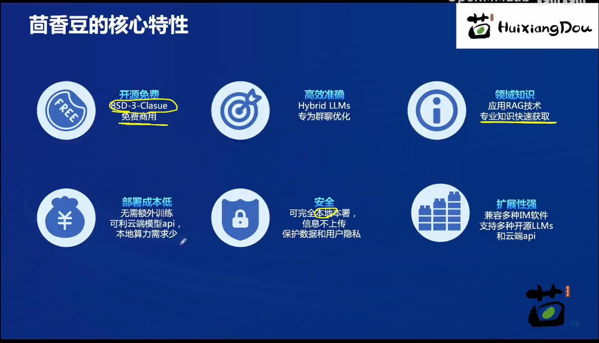

茴香豆的工作流分为三个部分：预处理（Preprocess），拒答工作流（Rejection Pipeline），应答工作流（Response Pipeline）,使用拒答工作流是为了方便更复杂的应用场景。

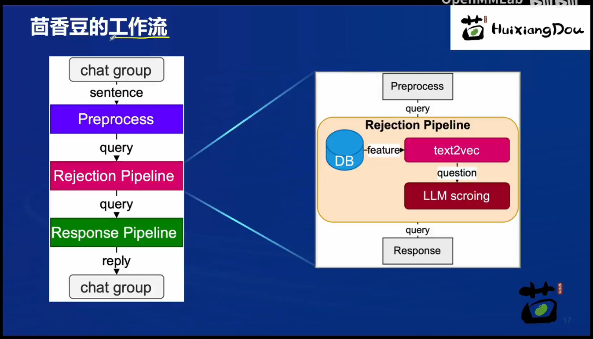

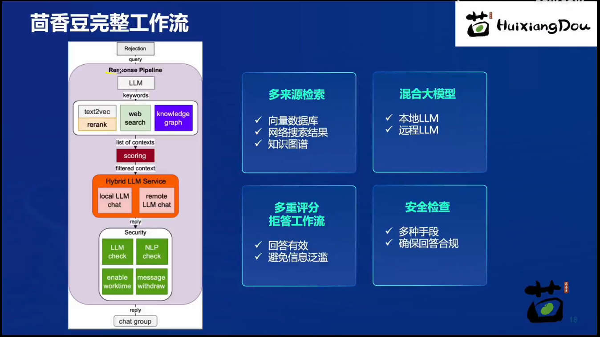

### 2.实战作业-Intern Studio上使用茴香豆搭建RAG助手

#### 2.1部署环境

还是先进入Studio开发机（申请30%算力即可），进入开发机后直接从官方环境中复制IntenLM的基础环境并且命名为命名为 `InternLM2_Huixiangdou`，在命令行模式下运行。

```python
studio-conda -o internlm-base -t InternLM2_Huixiangdou
```
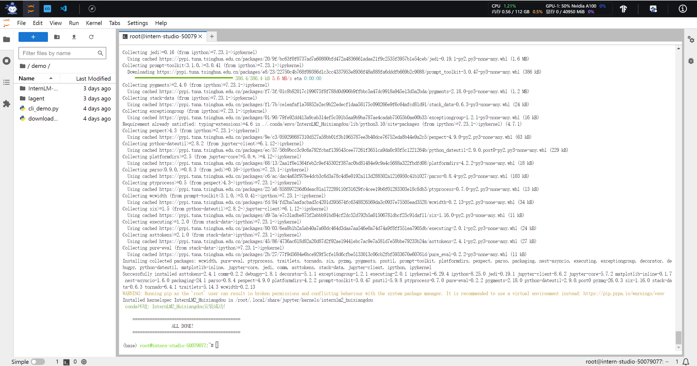


然后使用“conda env list”查看当前环境，展示结果如下：

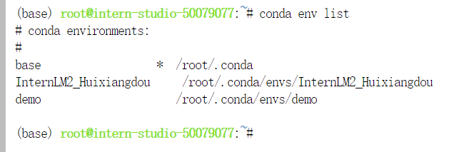


然后激活刚才我们创建的名为`InternLM2_Huixiangdou`的虚拟环境

```python
conda activate InternLM2_Huixiangdou
```
环境激活后，我们可以发现我们当前的环境名已经进入，在命令行最左边显示如下（重启开发机需要重新激活环境即可）：

#### 2.2下载基础文件

复制茴香豆需要的模型文件，为了减少去Huggingface上下载，我们直接在开发机中去选择InternLM2-chat-7B作为基础模型。

```python
# 创建模型文件夹
cd /root && mkdir models

# 复制BCE模型
ln -s /root/share/new_models/maidalun1020/bce-embedding-base_v1 /root/models/bce-embedding-base_v1
ln -s /root/share/new_models/maidalun1020/bce-reranker-base_v1 /root/models/bce-reranker-base_v1

# 复制大模型参数（下面的模型，根据作业进度和任务进行**选择一个**就行）
ln -s /root/share/new_models/Shanghai_AI_Laboratory/internlm2-chat-7b /root/models/internlm2-chat-7b

```
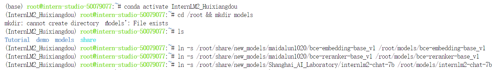

#### 2.3 下载安装茴香豆

安装茴香豆所需要的依赖

```python
# 安装 python 依赖
# pip install -r requirements.txt

pip install protobuf==4.25.3 accelerate==0.28.0 aiohttp==3.9.3 auto-gptq==0.7.1 bcembedding==0.1.3 beautifulsoup4==4.8.2 einops==0.7.0 faiss-gpu==1.7.2 langchain==0.1.14 loguru==0.7.2 lxml_html_clean==0.1.0 openai==1.16.1 openpyxl==3.1.2 pandas==2.2.1 pydantic==2.6.4 pymupdf==1.24.1 python-docx==1.1.0 pytoml==0.1.21 readability-lxml==0.8.1 redis==5.0.3 requests==2.31.0 scikit-learn==1.4.1.post1 sentence_transformers==2.2.2 textract==1.6.5 tiktoken==0.6.0 transformers==4.39.3 transformers_stream_generator==0.0.5 unstructured==0.11.2

## 因为 Intern Studio 不支持对系统文件的永久修改，在 Intern Studio 安装部署的同学不建议安装 Word 依赖，后续的操作和作业不会涉及 Word 解析。
## 想要自己尝试解析 Word 文件的同学，uncomment 掉下面这行，安装解析 .doc .docx 必需的依赖
# apt update && apt -y install python-dev python libxml2-dev libxslt1-dev antiword unrtf poppler-utils pstotext tesseract-ocr flac ffmpeg lame libmad0 libsox-fmt-mp3 sox libjpeg-dev swig libpulse-dev

```
从官方仓库中下载茴香豆

```python
cd /root
# 克隆代码仓库
git clone https://github.com/internlm/huixiangdou && cd huixiangdou
git checkout b9bc427
```
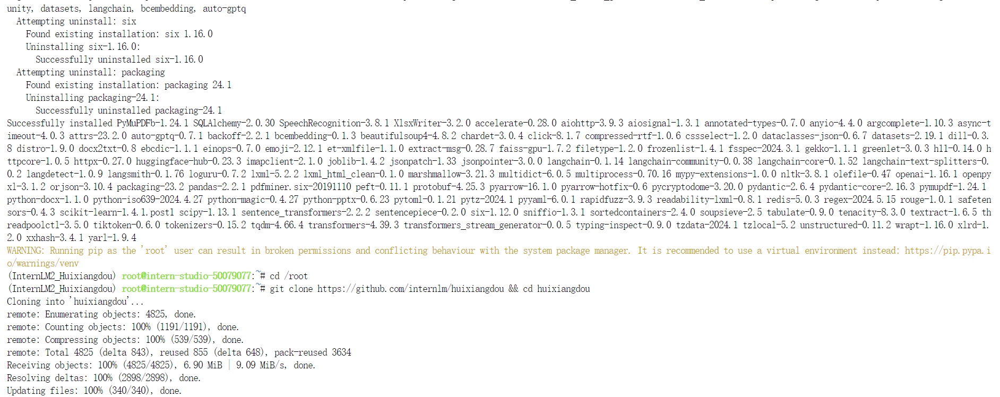

#### 2.4 使用茴香豆搭建RAG助手

修改配置文件，将下载模型的路径替换 `/root/huixiangdou/config.ini` 文件中的默认模型，需要修改 3 处模型地址，分别是:

命令行输入下面的命令，修改用于向量数据库和词嵌入的模型

```python
sed -i '6s#.*#embedding_model_path = "/root/models/bce-embedding-base_v1"#' /root/huixiangdou/config.ini
```

用于检索的重排序模型

```python
sed -i '7s#.*#reranker_model_path = "/root/models/bce-reranker-base_v1"#' /root/huixiangdou/config.ini
```

和本次选用的大模型

```python
sed -i '29s#.*#local_llm_path = "/root/models/internlm2-chat-7b"#' /root/huixiangdou/config.ini
```
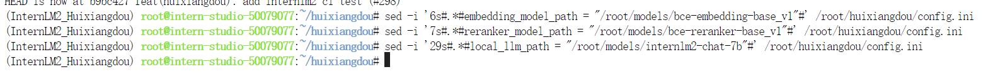

修改好的配置文件应该如下图所示：

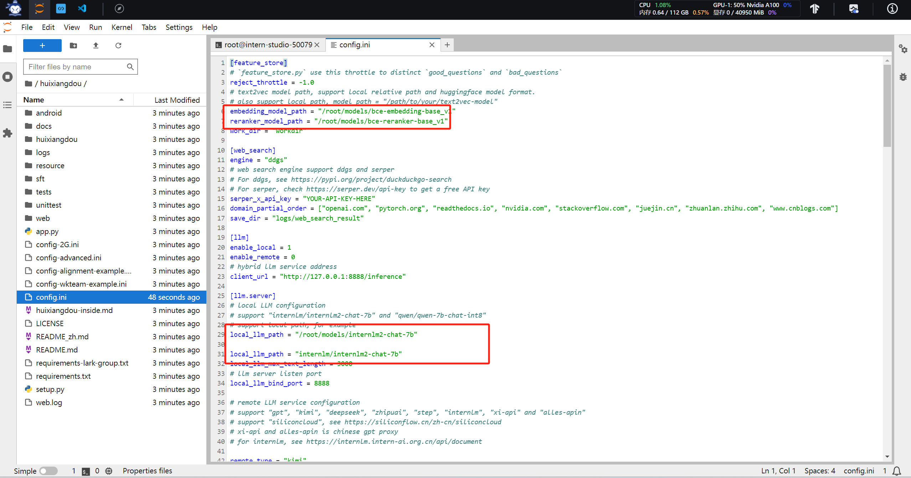

茴香豆工具在 `Intern Studio` 开发机的安装工作结束。如果部署在自己的服务器上，参考上节课模型下载内容或本节 [3.4 配置文件解析](### 34-配置文件解析) 部分内容下载模型文件。

创建知识库，使用 **InternLM** 的 **Huixiangdou** 文档作为新增知识数据检索来源，在不重新训练的情况下，打造一个 **Huixiangdou** 技术问答助手。首先，下载 **Huixiangdou** 语料：

```python
cd /root/huixiangdou && mkdir repodir  # 进入制定路径创建repodir目录

git clone https://github.com/internlm/huixiangdou --depth=1 repodir/huixiangdou
```
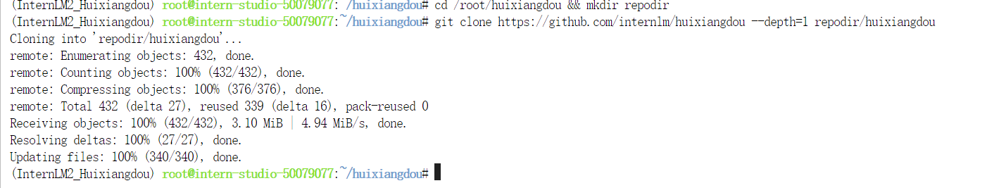

提取知识库特征，创建向量数据库，在这里向量数据库的量化过程应用了Langchain的相关模块，默认嵌入和重排序你先不管调用网易的BCE双语模型。除了语料知识的向量数据库外，茴香豆还创建了接受回答和拒答的向量数据库，来源如下：

- 接受问题列表，希望茴香豆助手回答的示例问题

  - 存储在 `huixiangdou/resource/good_questions.json` 中

- 拒绝问题列表，希望茴香豆助手拒答的示例问题

  - 存储在 `huixiangdou/resource/bad_questions.json` 中

运行相关命令，增加茴香豆相关的问题到接受回答的示例中。

```python
cd /root/huixiangdou  #如果已经进入到当前路径，可不执行此条命令
mv resource/good_questions.json resource/good_questions_bk.json

echo '[
    "mmpose中怎么调用mmyolo接口",
    "mmpose实现姿态估计后怎么实现行为识别",
    "mmpose执行提取关键点命令不是分为两步吗，一步是目标检测，另一步是关键点提取，我现在目标检测这部分的代码是demo/topdown_demo_with_mmdet.py demo/mmdetection_cfg/faster_rcnn_r50_fpn_coco.py checkpoints/faster_rcnn_r50_fpn_1x_coco_20200130-047c8118.pth   现在我想把这个mmdet的checkpoints换位yolo的，那么应该怎么操作",
    "在mmdetection中，如何同时加载两个数据集，两个dataloader",
    "如何将mmdetection2.28.2的retinanet配置文件改为单尺度的呢？",
    "1.MMPose_Tutorial.ipynb、inferencer_demo.py、image_demo.py、bottomup_demo.py、body3d_pose_lifter_demo.py这几个文件和topdown_demo_with_mmdet.py的区别是什么，\n2.我如果要使用mmdet是不是就只能使用topdown_demo_with_mmdet.py文件，",
    "mmpose 测试 map 一直是 0 怎么办？",
    "如何使用mmpose检测人体关键点？",
    "我使用的数据集是labelme标注的，我想知道mmpose的数据集都是什么样式的，全都是单目标的数据集标注，还是里边也有多目标然后进行标注",
    "如何生成openmmpose的c++推理脚本",
    "mmpose",
    "mmpose的目标检测阶段调用的模型，一定要是demo文件夹下的文件吗，有没有其他路径下的文件",
    "mmpose可以实现行为识别吗，如果要实现的话应该怎么做",
    "我在mmyolo的v0.6.0 (15/8/2023)更新日志里看到了他新增了支持基于 MMPose 的 YOLOX-Pose，我现在是不是只需要在mmpose/project/yolox-Pose内做出一些设置就可以，换掉demo/mmdetection_cfg/faster_rcnn_r50_fpn_coco.py 改用mmyolo来进行目标检测了",
    "mac m1从源码安装的mmpose是x86_64的",
    "想请教一下mmpose有没有提供可以读取外接摄像头，做3d姿态并达到实时的项目呀？",
    "huixiangdou 是什么？",
    "使用科研仪器需要注意什么？",
    "huixiangdou 是什么？",
    "茴香豆 是什么？",
    "茴香豆 能部署到微信吗？",
    "茴香豆 怎么应用到飞书",
    "茴香豆 能部署到微信群吗？",
    "茴香豆 怎么应用到飞书群",
    "huixiangdou 能部署到微信吗？",
    "huixiangdou 怎么应用到飞书",
    "huixiangdou 能部署到微信群吗？",
    "huixiangdou 怎么应用到飞书群",
    "huixiangdou",
    "茴香豆",
    "茴香豆 有哪些应用场景",
    "huixiangdou 有什么用",
    "huixiangdou 的优势有哪些？",
    "茴香豆 已经应用的场景",
    "huixiangdou 已经应用的场景",
    "huixiangdou 怎么安装",
    "茴香豆 怎么安装",
    "茴香豆 最新版本是什么",
    "茴香豆 支持哪些大模型",
    "茴香豆 支持哪些通讯软件",
    "config.ini 文件怎么配置",
    "remote_llm_model 可以填哪些模型?"
]' > /root/huixiangdou/resource/good_questions.json

```

这里我们可以去对应路径下查看`/root/huixiangdou/resource/good_questions.json`是否成功写入

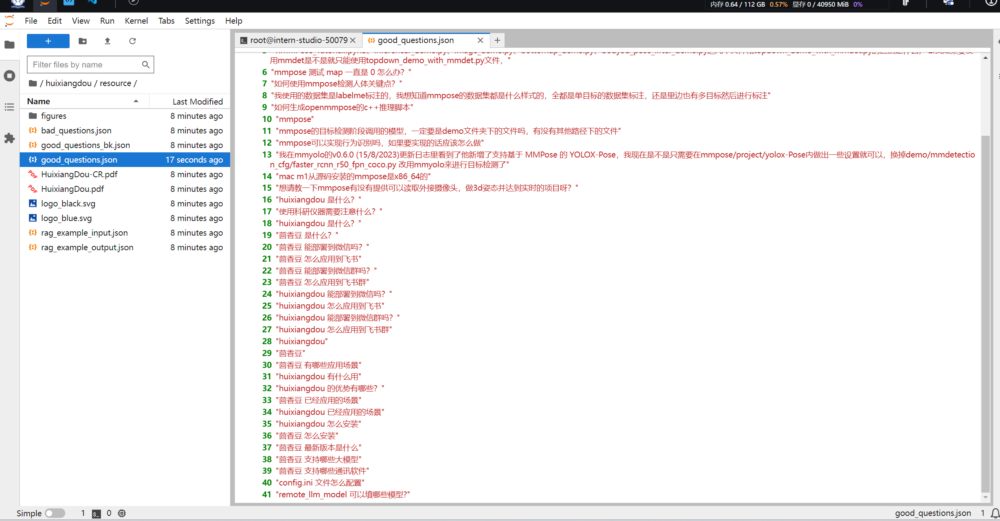

创建一个测试用的问询列表，测试拒答流程是否生效：

```python
cd /root/huixiangdou

echo '[
"huixiangdou 是什么？",
"你好，介绍下自己"
]' > ./test_queries.json

```
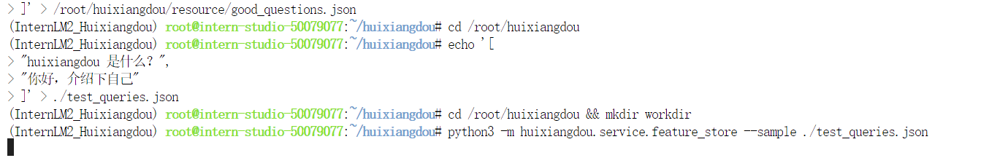

在确定好语料来源后，运行下面的命令，创建 RAG 检索过程中使用的向量数据库：

```python
# 创建向量数据库存储目录
cd /root/huixiangdou && mkdir workdir 

# 分别向量化知识语料、接受问题和拒绝问题中后保存到 workdir
python3 -m huixiangdou.service.feature_store --sample ./test_queries.json

```

向量数据库的创建需要等待一小段时间，过程约占用 1.6G 显存。

**重点！！这里构建向量数据库大家可能会遇到几个报错的问题，我建议大家要么和上面步骤一样仔细检查config.ini，你会发现问题所在，还有的错误形式就是缺少某些依赖库，这边直接使用`pip install xxxx`来解决即可。可能是官方偷偷给cv同学挖坑呢，所以根据步骤操作的时候一定要仔细检查并且熟练知道自己每一步操作的意义在哪，要细心啦~**

完成后，**Huixiangdou** 相关的新增知识就以向量数据库的形式存储在 `workdir` 文件夹下。

检索过程中，茴香豆会将输入问题与两个列表中的问题在向量空间进行相似性比较，判断该问题是否应该回答，避免群聊过程中的问答泛滥。确定的回答的问题会利用基础模型提取关键词，在知识库中检索 `top K` 相似的 `chunk`，综合问题和检索到的 `chunk` 生成答案。

#### 2.5 运行茴香豆知识助手

上述向量数据库创建好了之后，我们就可以测试效果：

```python
# 填入问题
sed -i '74s/.*/    queries = ["huixiangdou 是什么？", "茴香豆怎么部署到微信群", "今天天气怎么样？"]/' /root/huixiangdou/huixiangdou/main.py

# 运行茴香豆
cd /root/huixiangdou/
python3 -m huixiangdou.main --standalone

```
RAG 技术的优势就是非参数化的模型调优，这里使用的仍然是基础模型 `InternLM2-Chat-7B`， 没有任何额外数据的训练。面对同样的问题，我们的**茴香豆技术助理**能够根据我们提供的数据库生成准确的答案：

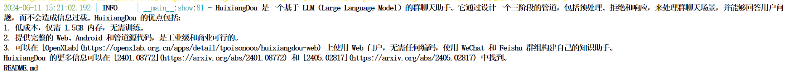

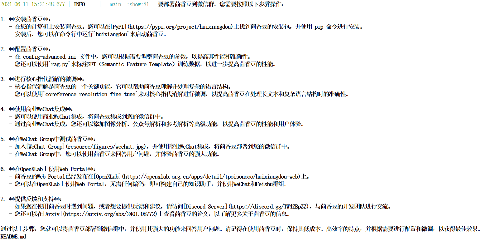

这里我们可以参考第二节课部署InternLM2-Chat-7B模型去验证下关于huixiangdou问题的原始输出，就是需要切换我们上一节课创建的demo虚拟环境，然后直接python解释器去执行`python /root/demo/cli_demo.py`即可。

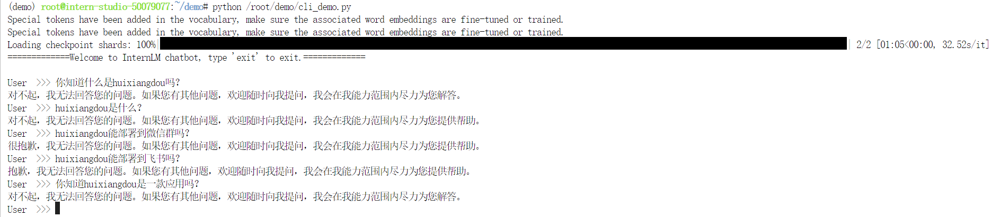

下面是执行茴香豆后的执行流程

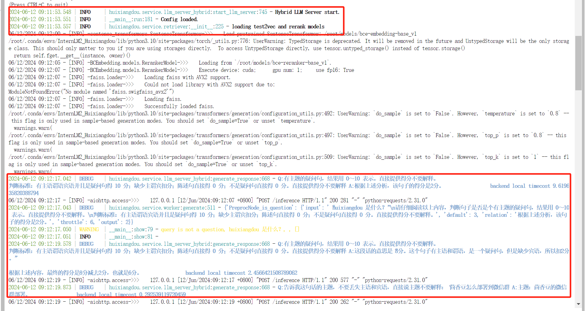

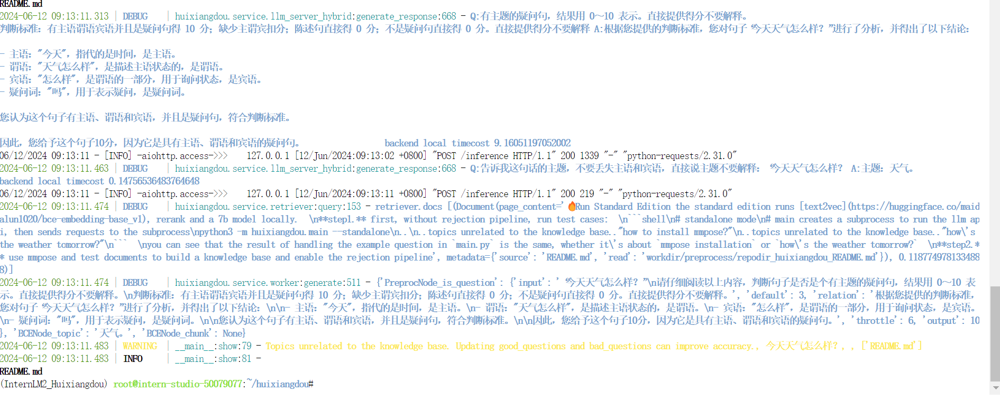

**总结：同学们发现执行茴香豆后，有三个INFO输出，LLM服务启动，config配置文件加载，加载test2vec和重排models，然后下面会先判断是否疑问句并且1-10分打分，感兴趣的同学可以深入研究下整个茴香豆的执行流程。**

### 3.茴香豆进阶（选做）

首先有没有发现上面用RAG的方式的知识助手提问方式比较粗糙，当然也是为了方便我们理解RAG的工作流，忘记的同学可以看前面视频笔记哦。

#### 3.1 加入网络搜索

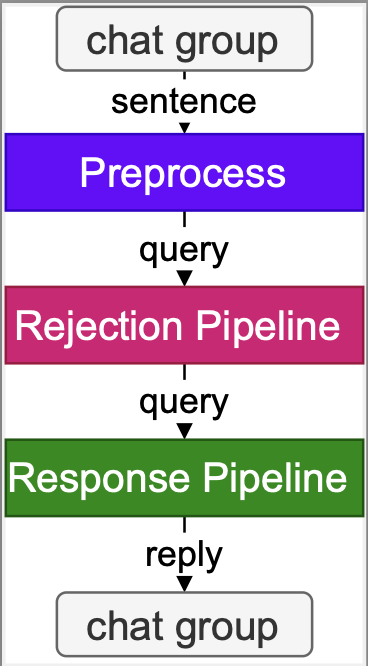

茴香豆除了可以从本地向量数据库中检索内容进行回答，也可以加入网络的搜索结果，生成回答。

开启网络搜索功能需要用到 **Serper** 提供的 API：
登录 [Serper](https://serper.dev/) ，注册：


然后进入到Serper API界面，复制自己的API-key：

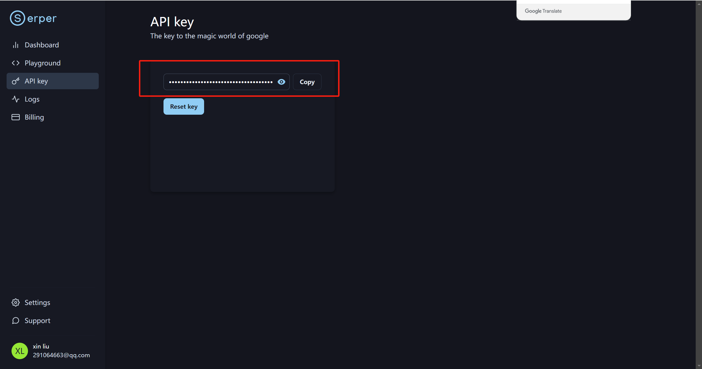

将这个key替换 `/huixiangdou/config.ini` 中的 ***${YOUR-API-KEY}*** 为自己的API-key：

```python
[web_search]
# check https://serper.dev/api-key to get a free API key
x_api_key = "${YOUR-API-KEY}"
domain_partial_order = ["openai.com", "pytorch.org", "readthedocs.io", "nvidia.com", "stackoverflow.com", "juejin.cn", "zhuanlan.zhihu.com", "www.cnblogs.com"]
save_dir = "logs/web_search_result"
```

其中 `domain_partial_order` 可以设置网络搜索的范围。

config.ini配置文件修改：

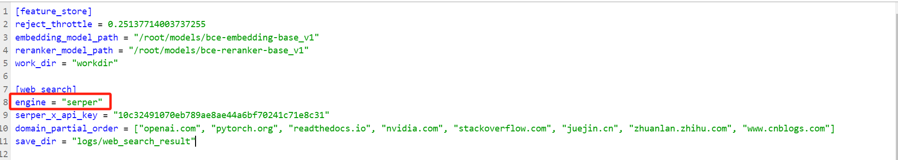

**可以看到茴香豆会去知乎，csdn博客去检索相关的回答。**

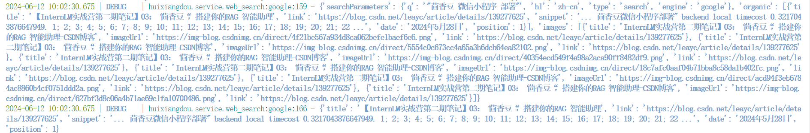


#### 3.2 接下来就是需要自己使用远程模型

茴香豆除了可以使用本地大模型，还可以轻松的调用云端模型 API。

目前，茴香豆已经支持 `Kimi`，`GPT-4`，`Deepseek` 和 `GLM` 等常见大模型API。

想要使用远端大模型，首先修改 `/huixiangdou/config.ini` 文件中

```python
enable_local = 0 # 关闭本地模型
enable_remote = 1 # 启用云端模型
```
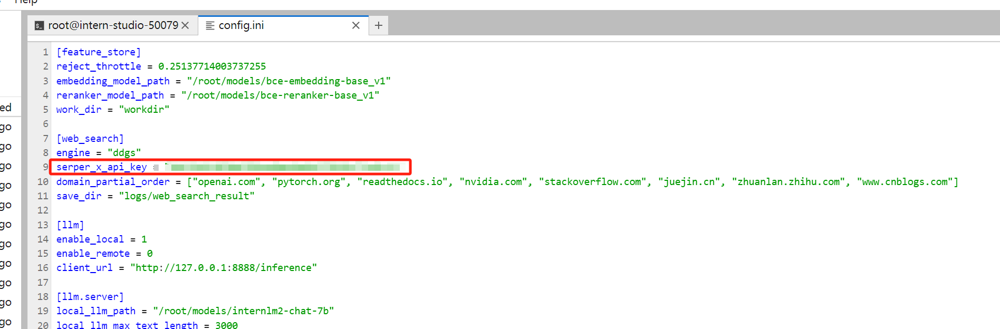

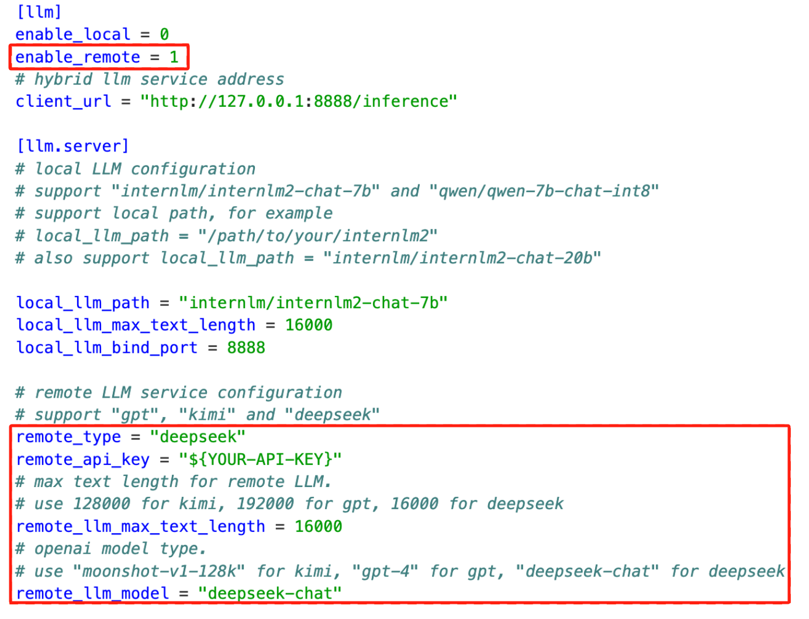

接着，如下图所示，修改 `remote_` 相关配置，填写 API key、模型类型等参数。

| 远端模型配置选项 | GPT | Kimi | Deepseek | ChatGLM | xi-api | alles-apin |
|---|---|---|---|---|---|---|
| `remote_type`| gpt | kimi | deepseek | zhipuai | xi-api | alles-apin |
| `remote_llm_max_text_length` 最大值 | 192000 | 128000 | 16000 | 128000 | 192000 | - |
| `remote_llm_model` | "gpt-4-0613"| "moonshot-v1-128k" | "deepseek-chat" | "glm-4" | "gpt-4-0613" | - |


启用远程模型可以大大降低GPU显存需求，根据测试，采用远程模型的茴香豆应用，最小只需要2G显存即可。

需要注意的是，这里启用的远程模型，只用在问答分析和问题生成，依然需要本地嵌入、重排序模型进行特征提取。

这里**远端模型**我采用的还是**zhipuai**，感兴趣的同学可以去注册一下，然后申请一个api秘钥，在config.ini配置中去填写

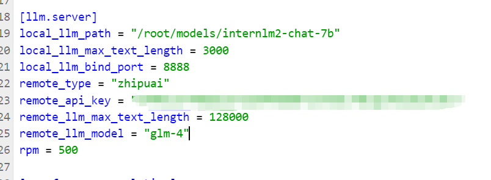

也可以尝试同时开启 local 和 remote 模型，茴香豆将采用混合模型的方案，详见 [技术报告](https://arxiv.org/abs/2401.08772)，效果更好。

**tips：这里我就不验证模型的效果了，感兴趣的同学可以去配置文件中启用local 和 remote 模型**

[茴香豆 Web 版](https://openxlab.org.cn/apps/detail/tpoisonooo/huixiangdou-web) 在 **OpenXLab** 上部署了混合模型的 Demo，可上传自己的语料库测试效果。

##### 3.3 利用Gradio搭建网页的demo

说真的，记笔记记到这，纯纯的有点累了，接下来建议直接命令执行吧

```python
pip install gradio==4.25.0 redis==5.0.3 flask==3.0.2 lark_oapi==1.2.4   # 安装Gradio相关依赖

cd /root/huixiangdou    #进入指定路径
python3 -m tests.test_query_gradio   # 运行脚本
```

接下来就是和之前课程笔记操作一样，首先查看开发机的端口和密码，然后本地直接cmd去连接ssh，

```python
ssh -CNg -L 7860:127.0.0.1:7860 root@ssh.intern-ai.org.cn -p <你的端口号>
```

建立开发机到本地端口的映射

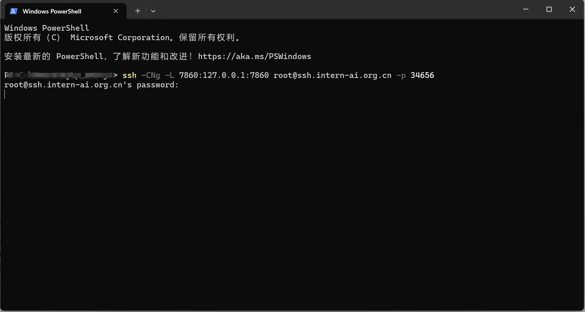

如果需要更换检索的知识领域，只需要用新的语料知识重复步骤 [2.2 创建知识库](#### 2.4 使用茴香豆搭建RAG助手) 提取特征到新的向量数据库，更改 `huixiangdou/config.ini` 文件中 `work_dir = "新向量数据库路径"`；

或者运行： 

```
python3 -m tests.test_query_gradi --work_dir <新向量数据库路径>
```

无需重新训练或微调模型，就可以轻松的让基础模型学会新领域知识，搭建一个新的问答助手。

**这里搭建的网页demo，说实话，博主真的是事故频发，你以为你改了config配置文件导致了输出不理想，实际上你仔细想想，你改动的无非是一些模型名，或者是否启用本地还是远端模型。哪怕是BCE模型都是之前命令就帮你修改好的，但是huixiangdou在根据提问结果的时候就是跳转拒绝流上面了。然后就换不同Question提问方式，你才明白的，同学可以自己尝试。**

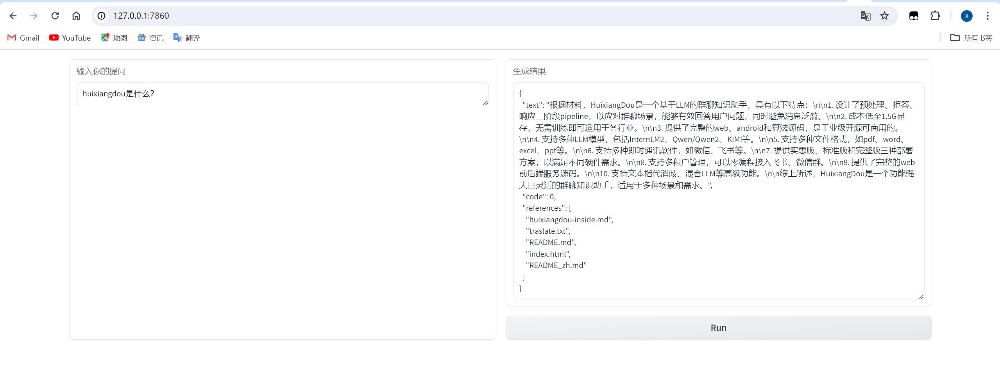

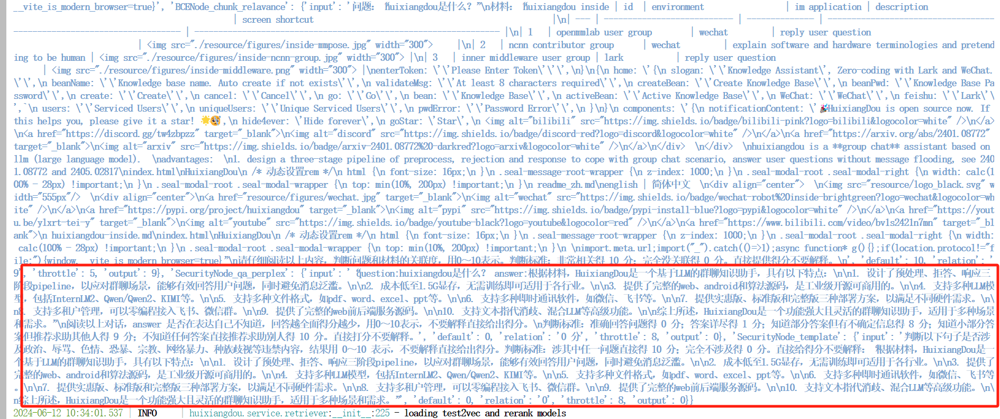


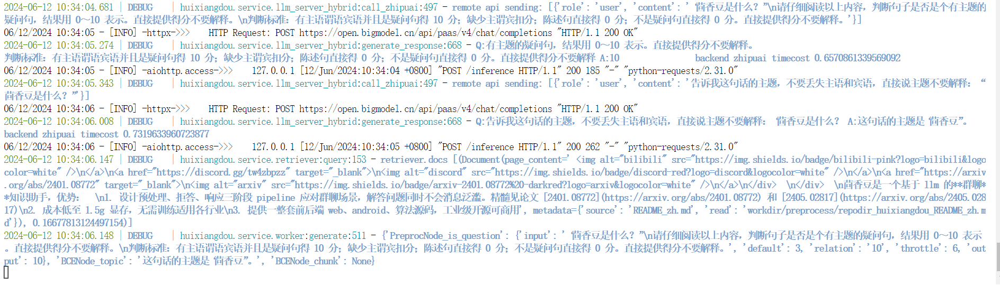

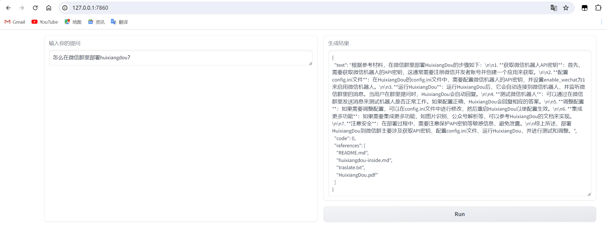

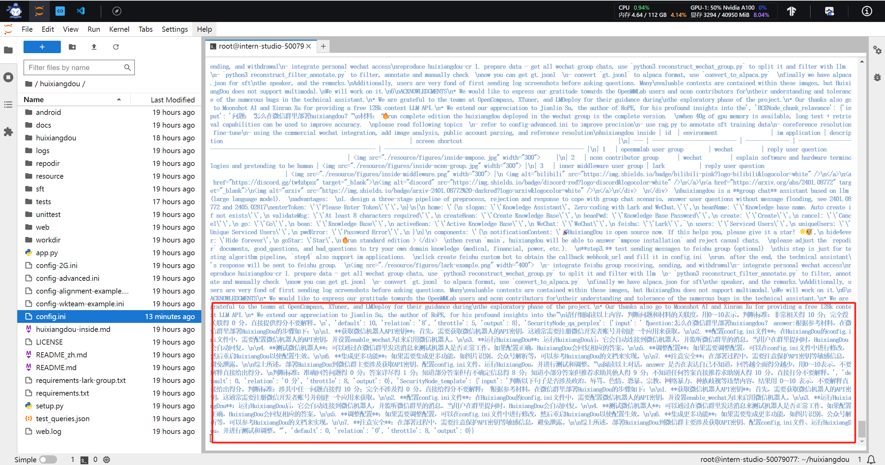

上面是两个不同方式，同一个问题的输出，包含了huixiangdou的执行流程截图，建议同学自己深入去分析理解下具体的执行流。这里要说明一下，上面输出采用的还是**zhipuai**的回答（大家可以根据教程选择deepseek，也需要去申请API的哦~），我们可以发现InternLM2-chat-7b在某些输出效果上有一定的要求。

### 3.4 配置文件解析

茴香豆的配置文件位于代码主目录下，采用 `Toml` 形式，有着丰富的功能，下面将解析配置文件中重要的常用参数。

```
[feature_store]
...
reject_throttle = 0.22742061846268935
...
embedding_model_path = "/root/models/bce-embedding-base_v1"
reranker_model_path = "/root/models/bce-reranker-base_v1"
...
work_dir = "workdir"
```

`reject_throttle`: 拒答阈值，0-1，数值越大，回答的问题相关性越高。拒答分数在检索过程中通过与示例问题的相似性检索得出，高质量的问题得分高，无关、低质量的问题得分低。只有得分数大于拒答阈值的才会被视为相关问题，用于回答的生成。当闲聊或无关问题较多的环境可以适当调高。
`embedding_model_path` 和 `reranker_model_path`: 嵌入和重排用到的模型路径。不设置本地模型路径情况下，默认自动通过 ***Huggingface*** 下载。开始自动下载前，需要使用下列命令登录 ***Huggingface*** 账户获取权限：

```bash
huggingface-cli login
```

`work_dir`: 向量数据库路径。茴香豆安装后，可以通过切换向量数据库路径，来回答不同知识领域的问答。

```
[llm.server]
...
local_llm_path = "/root/models/internlm2-chat-1_8b"
local_llm_max_text_length = 3000
...
```

`local_llm_path`: 本地模型文件夹路径或模型名称。现支持 **书生·浦语** 和 **通义千问** 模型类型，调用 `transformers` 的 `AutoModels` 模块，除了模型路径，输入 ***Huggingface*** 上的模型名称，如"internlm/internlm2-chat-7b"、"qwen/qwen-7b-chat-int8"、"internlm/internlm2-chat-20b"，也可自动拉取模型文件。
`local_llm_max_text_length`: 模型可接受最大文本长度。

远端模型支持参考上一小节。


```
[worker]
# enable search enhancement or not
enable_sg_search = 0
save_path = "logs/work.txt"
...
```
`[worker]`: 增强搜索功能，配合 `[sg_search]` 使用。增强搜索利用知识领域的源文件建立图数据库，当模型判断问题为无关问题或回答失败时，增强搜索功能将利用 LLM 提取的关键词在该图数据库中搜索，并尝试用搜索到的内容重新生成答案。在 `config.ini` 中查看 `[sg_search]` 具体配置示例。

```
[worker.time]
start = "00:00:00"
end = "23:59:59"
has_weekday = 1
```
`[worker.time]`: 可以设置茴香豆每天的工作时间，通过 `start` 和 `end` 设定应答的起始和结束时间。
`has_weekday`: `= 1` 的时候，周末不应答😂（豆哥拒绝 996）。 

```
[frontend]
...
```
`[fronted]`:  前端交互设置。[茴香豆代码仓库](https://github.com/InternLM/HuixiangDou/tree/main/docs) 查看具体教程。


### 3.5 文件结构

通过了解主要文件的位置和作用，可以更好的理解茴香豆的工作原理。

```bash
.
├── LICENSE
├── README.md
├── README_zh.md
├── android
├── app.py
├── config-2G.ini
├── config-advanced.ini
├── config-experience.ini
├── config.ini # 配置文件
├── docs # 教学文档
├── huixiangdou # 存放茴香豆主要代码，重点学习
├── huixiangdou-inside.md
├── logs
├── repodir # 默认存放个人数据库原始文件，用户建立
├── requirements-lark-group.txt
├── requirements.txt
├── resource
├── setup.py
├── tests # 单元测试
├── web # 存放茴香豆 Web 版代码
└── web.log
└── workdir # 默认存放茴香豆本地向量数据库，用户建立
```


```bash
./huixiangdou
├── __init__.py
├── frontend # 存放茴香豆前端与用户端和通讯软件交互代码
│   ├── __init__.py
│   ├── lark.py
│   └── lark_group.py
├── main.py # 运行主贷
├── service # 存放茴香豆后端工作流代码
│   ├── __init__.py
│   ├── config.py #
│   ├── feature_store.py # 数据嵌入、特征提取代码
│   ├── file_operation.py
│   ├── helper.py
│   ├── llm_client.py
│   ├── llm_server_hybrid.py # 混合模型代码
│   ├── retriever.py # 检索模块代码
│   ├── sg_search.py # 增强搜索，图检索代码
│   ├── web_search.py # 网页搜索代码
│   └── worker.py # 主流程代码
└── version.py
```

茴香豆工作流中用到的 **Prompt** 位于 `huixiangdou/service/worker.py` 中。可以根据业务需求尝试调整 **Prompt**，打造你独有的茴香豆知识助手。

```python
...
        # Switch languages according to the scenario.
        if self.language == 'zh':
            self.TOPIC_TEMPLATE = '告诉我这句话的主题，直接说主题不要解释：“{}”'
            self.SCORING_QUESTION_TEMPLTE = '“{}”\n请仔细阅读以上内容，判断句子是否是个有主题的疑问句，结果用 0～10 表示。直接提供得分不要解释。\n判断标准：有主语谓语宾语并且是疑问句得 10 分；缺少主谓宾扣分；陈述句直接得 0 分；不是疑问句直接得 0 分。直接提供得分不要解释。'  # noqa E501
            self.SCORING_RELAVANCE_TEMPLATE = '问题：“{}”\n材料：“{}”\n请仔细阅读以上内容，判断问题和材料的关联度，用0～10表示。判断标准：非常相关得 10 分；完全没关联得 0 分。直接提供得分不要解释。\n'  # noqa E501
            self.KEYWORDS_TEMPLATE = '谷歌搜索是一个通用搜索引擎，可用于访问互联网、查询百科知识、了解时事新闻等。搜索参数类型 string， 内容是短语或关键字，以空格分隔。\n你现在是{}交流群里的技术助手，用户问“{}”，你打算通过谷歌搜索查询相关资料，请提供用于搜索的关键字或短语，不要解释直接给出关键字或短语。'  # noqa E501
            self.SECURITY_TEMAPLTE = '判断以下句子是否涉及政治、辱骂、色情、恐暴、宗教、网络暴力、种族歧视等违禁内容，结果用 0～10 表示，不要解释直接给出得分。判断标准：涉其中任一问题直接得 10 分；完全不涉及得 0 分。直接给得分不要解释：“{}”'  # noqa E501
            self.PERPLESITY_TEMPLATE = '“question:{} answer:{}”\n阅读以上对话，answer 是否在表达自己不知道，回答越全面得分越少，用0～10表示，不要解释直接给出得分。\n判断标准：准确回答问题得 0 分；答案详尽得 1 分；知道部分答案但有不确定信息得 8 分；知道小部分答案但推荐求助其他人得 9 分；不知道任何答案直接推荐求助别人得 10 分。直接打分不要解释。'  # noqa E501
            self.SUMMARIZE_TEMPLATE = '{} \n 仔细阅读以上内容，总结得简短有力点'  # noqa E501
            # self.GENERATE_TEMPLATE = '材料：“{}”\n 问题：“{}” \n 请仔细阅读参考材料回答问题，材料可能和问题无关。如果材料和问题无关，尝试用你自己的理解来回答问题。如果无法确定答案，直接回答不知道。'  # noqa E501
            self.GENERATE_TEMPLATE = '材料：“{}”\n 问题：“{}” \n 请仔细阅读参考材料回答问题。'  # noqa E501
...
```


### 总结一下

使用RAG检索增强技术通过接入外部知识库，显著的提高模型的准确性以及实时更新性的问题，很好了解决了模型对未曾训练的内容出现幻觉回答，也不需要消耗训练时间继续更新模型。强烈推荐同学实操RAG这篇技术博客，谢谢阅读。
